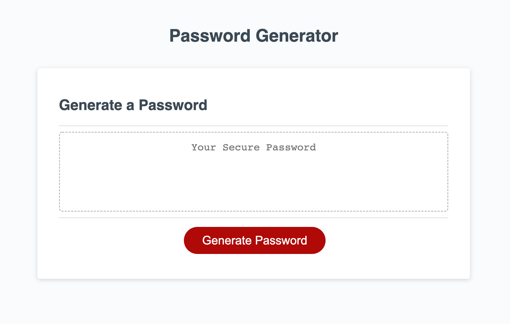
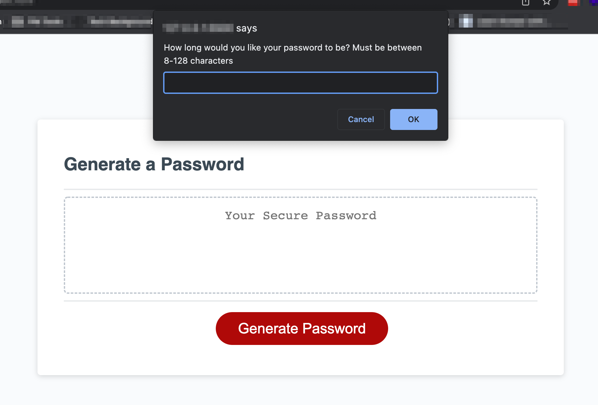
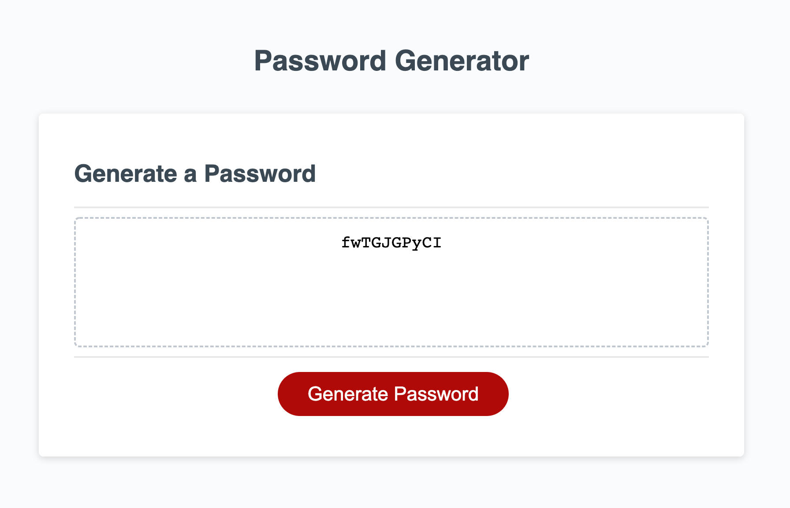

# Jessica Chen - Password Generator

## Columbia University Bootcamp - JavaScript Challenge: Password Generator

> This repository contains my password generator application that helps employees generate a random password based on their desired criteria.
> Live Site: https://jess-n-chen.github.io/jc-cu-c3-password-generator/

## Table of Contents

- [General Info](#general-information)
- [Project Requirements](#project-requirements)
- [Screenshots](#screenshots)
- [Source Code](#source-code)
- [Contact](#contact)

## General Information

This repository contains my password generator application that helps employees generate a random password based on their desired criteria. It is responsive to various screen sizes.

## Project Requirements

User Story:

```
AS AN employee with access to sensitive data
I WANT to randomly generate a password that meets certain criteria
SO THAT I can create a strong password that provides greater security
```

Acceptance Criteria:

```
GIVEN I need a new, secure password
WHEN I click the button to generate a password
THEN I am presented with a series of prompts for password criteria
WHEN prompted for password criteria
THEN I select which criteria to include in the password
WHEN prompted for the length of the password
THEN I choose a length of at least 8 characters and no more than 128 characters
WHEN asked for character types to include in the password
THEN I confirm whether or not to include lowercase, uppercase, numeric, and/or special characters
WHEN I answer each prompt
THEN my input should be validated and at least one character type should be selected
WHEN all prompts are answered
THEN a password is generated that matches the selected criteria
WHEN the password is generated
THEN the password is either displayed in an alert or written to the page
```

## Screenshots





## Source Code

Source Code Reference: https://github.com/coding-boot-camp/friendly-parakeet

## Contact

Created by: Jessica Chen | jessicachen28@gmail.com
